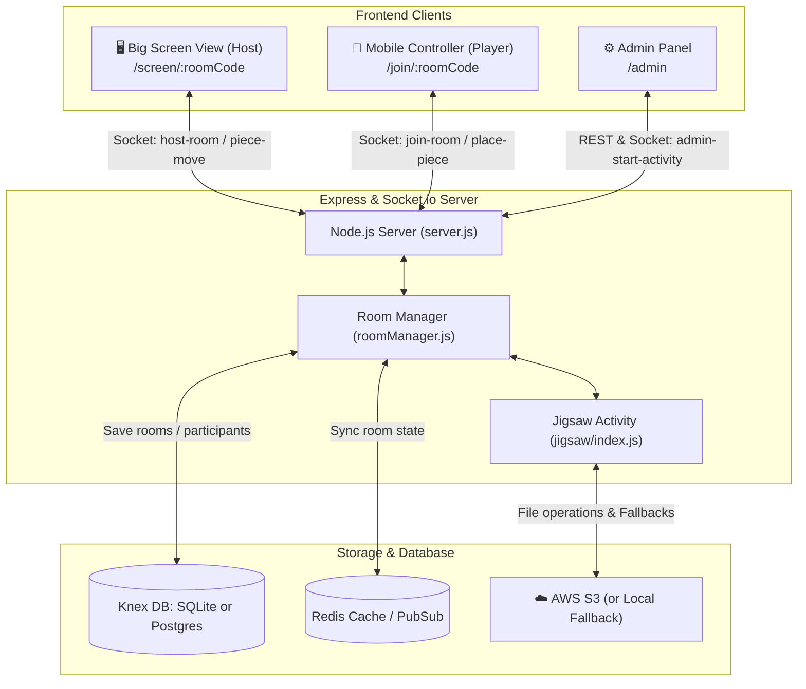
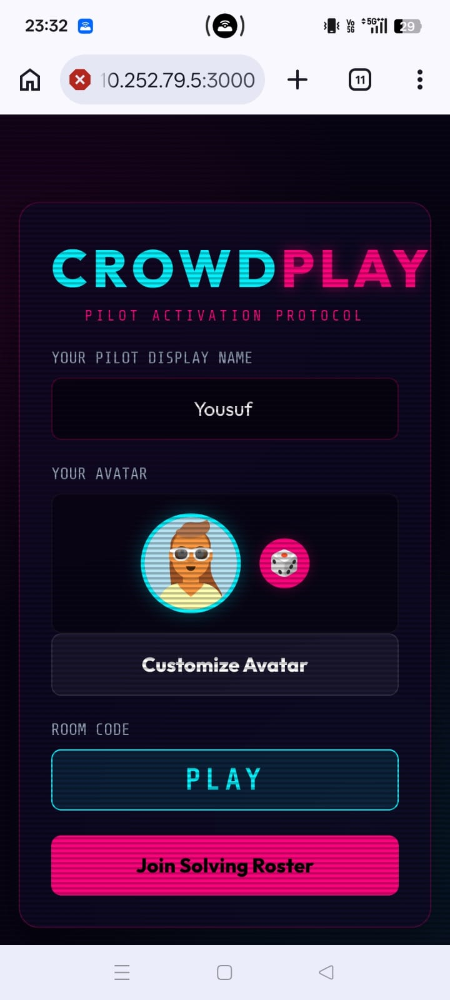
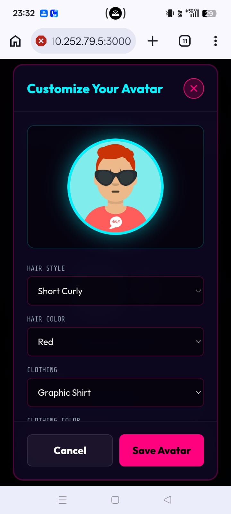
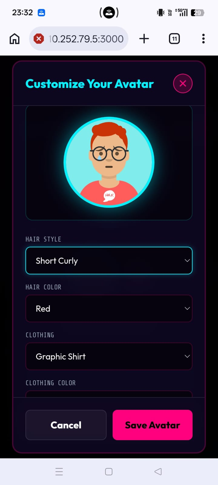
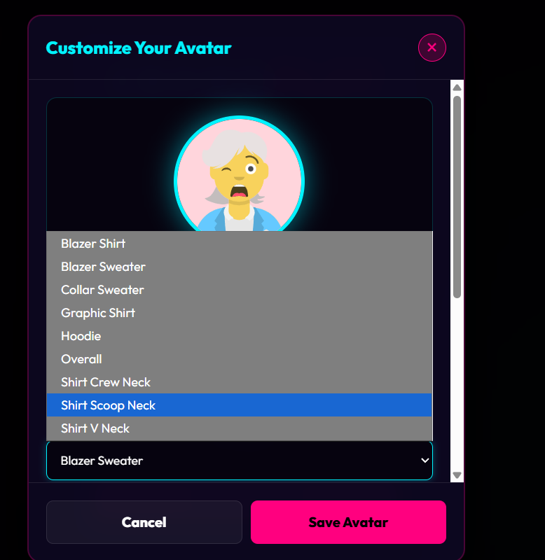
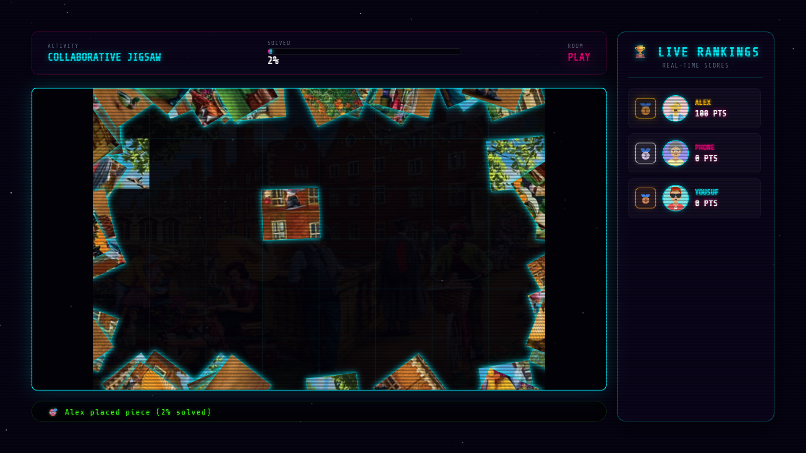
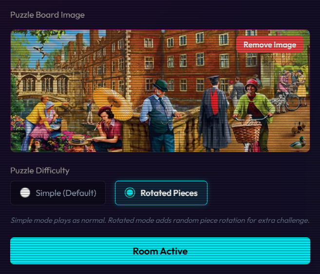
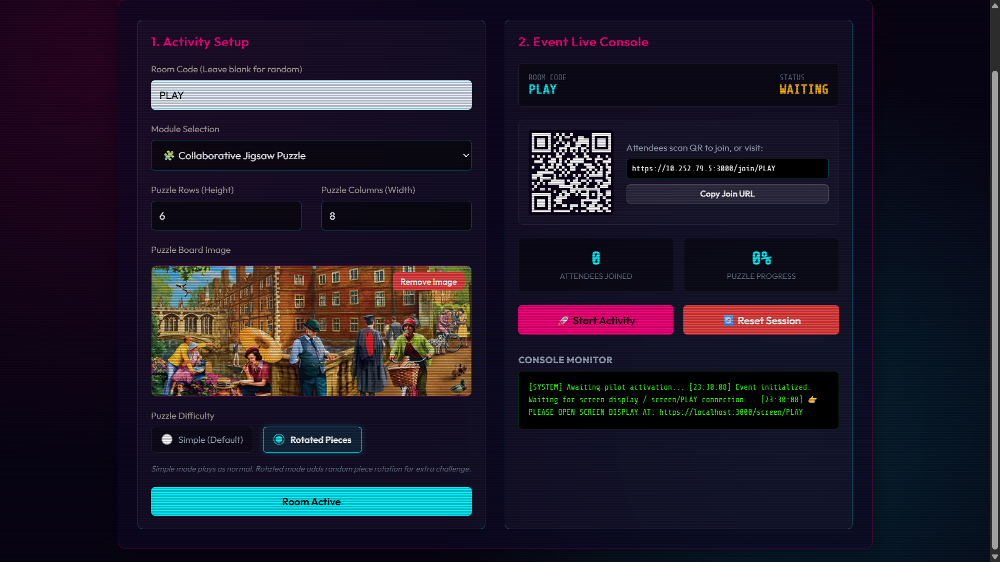
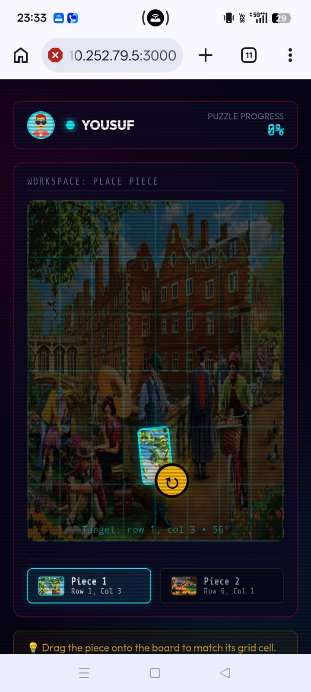
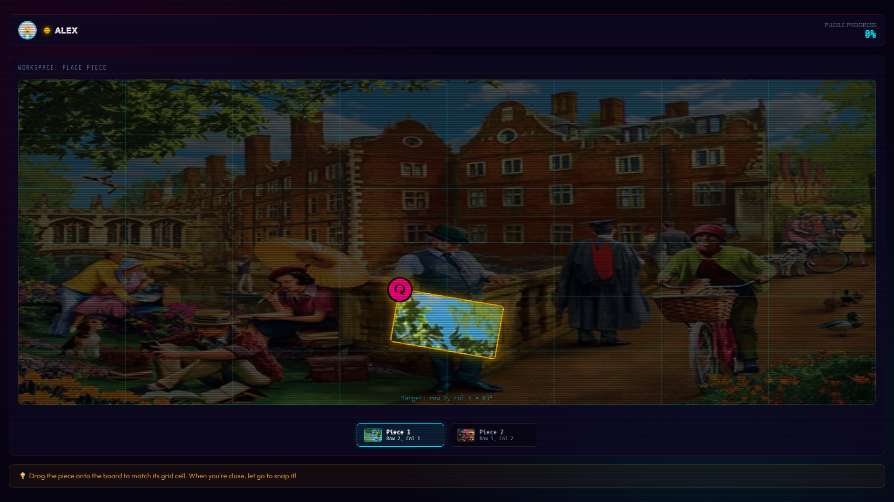

# CrowdPlay: Real-Time Multiplayer Synthwave Jigsaw Puzzle

Welcome to **CrowdPlay**, a real-time, mobile-controlled multiplayer Jigsaw puzzle game built with Node.js, Express, and Socket.io. 

CrowdPlay is designed to run in a hybrid environment: a **Big Screen View** (e.g., a TV or projector) displays the shared puzzle board, while players connect using their **Mobile Controllers** via a simple 4-character room code to drag, drop, and snap puzzle pieces into place in real time.

---

## 🎮 How It Works



1. **Host Setup**: The host opens the **Big Screen View** at `/screen/DEMO` (or any generated room code). This establishes a Socket.io host connection.
2. **Player Joins**: Players scan a QR code or visit `/join/[ROOM_CODE]`, enter their name, and get assigned a unique neon color.
3. **Admin Launch**: The administrator uses the `/admin` dashboard to select a puzzle image (or upload one), configure the grid dimensions (rows/columns), and start the activity.
4. **Gameplay**:
   - The server uses the `sharp` library to slice the chosen image into grid pieces.
   - The server assigns pieces to active players (up to 2 at a time).
   - Players drag and drop pieces on their phone. Drag coordinates are synced live to the Big Screen.
   - When a player drops a piece near its correct coordinates, it snaps into place, awards points, and gives the player new pieces until the puzzle is completed.

---

## 🚀 Enhancements Added After Fork

This fork extends the original CrowdPlay experience with three major feature enhancements designed to increase player engagement, competitive dynamics, and gameplay depth.

### 🎭 Custom Player Avatars

Players can now personalize their in-game identity by selecting and customizing a unique avatar before joining a game.

**Features:**
- **DiceBear API Integration**: Leverages the DiceBear Avataaars style API (v10.x) to generate diverse, customizable avatars
- **Real-Time Customization**: Interactive modal interface allows players to adjust:
  - Hair style and color (30+ variants)
  - Clothing style and color
  - Accessories (eyewear, eyepatch, etc.)
  - Skin tone
  - Background color
- **Randomization**: One-click randomize button for instant avatar generation
- **Persistent Display**: Avatars appear consistently across all game screens:
  - Join screen (avatar preview and customization)
  - Lobby waiting room
  - Gameplay header
  - Live leaderboard
  - Winner celebration screen

**Benefits:**
- Improved player identity and recognition
- Enhanced multiplayer engagement
- Easier tracking of individual players during gameplay
- More personalized experience in crowd gaming environments

<h4>Avatar Selection</h4>

<p align="center">
  
  
</p>

<p align="center">
  
  
</p>

### 🏆 Real-Time Live Leaderboard

A dynamic, spectator-friendly leaderboard panel now displays on the main shared screen throughout gameplay, updating instantly as players earn points.

**Features:**
- **Live Score Updates**: Leaderboard automatically updates in real-time via Socket.IO events
- **Automatic Ranking**: Players are sorted dynamically by score (descending)
- **Animated Rank Changes**: Smooth slide animations highlight position changes
- **Special Top 3 Styling**:
  - 🥇 Gold medal for 1st place with continuous pulse animation
  - 🥈 Silver medal for 2nd place
  - 🥉 Bronze medal for 3rd place
- **Player Information Display**: Shows rank, avatar, display name, and current score
- **Optimized for Spectators**: Large text, high contrast, visible from a distance
- **Debounced Updates**: Efficient rendering with 500ms debounce to handle rapid score changes

**Display Format:**
```
#  [Avatar]  PLAYER NAME     SCORE
🥇 [Avatar]  ALICE          150 PTS
🥈 [Avatar]  BOB            120 PTS
🥉 [Avatar]  CHARLIE        100 PTS
#4 [Avatar]  DIANA           85 PTS
```

**Implementation:**
- Leaderboard panel positioned on the right side of the main screen (350px width)
- Does not interfere with mobile player experience (screen-only feature)
- Scrollable container supports any number of players
- Updates triggered by `piece-placed` socket events with player score data

**Benefits:**
- Encourages competitive gameplay
- Creates excitement and engagement for both players and spectators
- Provides instant feedback on player performance
- Enhances the crowd gaming experience in event/conference settings

**Screenshots:**

<h4>Avatar Selection</h4>

<p align="center">
  
</p>


---

### 🧩 Advanced Puzzle Difficulty: Rotated Pieces

A new difficulty mode introduces piece rotation mechanics, significantly increasing puzzle complexity and adding a skill-based challenge layer.

**Features:**
- **Dual Difficulty Modes**:
  - **Simple Mode** (Default): Preserves original gameplay with correctly oriented pieces
  - **Rotated Pieces Mode**: Introduces random rotation challenge
- **Random Initial Rotation**: In rotated mode, each piece spawns with a random 0-359° orientation
- **Rotation Controls**: Players use a dedicated rotation handle (circular button) on mobile devices
- **Free-Angle Rotation**: Continuous rotation (not limited to 90° increments) via intuitive drag-to-rotate gesture
- **Placement Validation**: Server validates both position AND rotation (±10° tolerance)
- **Visual Feedback**:
  - Rotation handle changes color when active
  - Current rotation angle displayed as hint text
  - Smooth CSS transform animations during rotation
- **Backward Compatible**: Simple mode ensures existing gameplay remains unchanged

**Rotation Mechanics:**
- **Rotation Handle**: Yellow circular button with rotate icon (↻) positioned at bottom-right of piece
- **Gesture-Based**: Drag the rotation handle in a circular motion around the piece center
- **Live Updates**: Rotation state synced to server and other clients in real-time
- **Tolerance System**: ±10° tolerance prevents frustration while maintaining challenge

**Admin Configuration:**
- Difficulty selector added to admin panel setup form
- Radio button interface: `Simple (Default)` / `Rotated Pieces`
- Difficulty parameter sent with `admin-start-activity` socket event

**Benefits:**
- Dramatically increases puzzle difficulty
- Introduces spatial reasoning and orientation skills
- Creates greater player skill differentiation
- Adds significant replayability to existing puzzle content
- Enables advanced player challenges and competitive modes

**Screenshots:**
<h4>Avatar Selection</h4>

<p align="center">
  
</p>
<p align="center">

</p>
<br>
<p align="center">
  
</p>
<p align="center">
  
</p>

---

### 📊 Fork Enhancements Summary

This fork extends the original CrowdPlay multiplayer puzzle experience with:

- ✅ **Personalized player avatars** with real-time customization
- ✅ **Real-time competitive leaderboard** with animations and spectator-friendly design
- ✅ **Advanced puzzle difficulty modes** with free-angle piece rotation
- ✅ **Enhanced multiplayer engagement** and social gameplay dynamics
- ✅ **Improved spectator experience** for event and conference settings
- ✅ **Increased gameplay depth and replayability** through difficulty scaling

These additions were designed to build upon the existing Socket.IO architecture while maintaining full backward compatibility with the original game flow and multiplayer systems.

---

## 📂 Project Structure

```bash
├── Dockerfile                  # Production container configuration
├── server.js                   # Application entry point, server boot & SSL config
├── crowdplay.sqlite            # Local development SQLite database (auto-generated)
├── public/                     # Static frontend files (HTML, CSS, JS)
│   ├── index.html              # Landing page
│   ├── admin.html / .js / .css # Admin panel to upload images & launch rooms
│   ├── mobile.html / .js / .css# Mobile player controller UI
│   ├── screen.html / .js / .css# Shared big screen viewer UI
│   ├── style.css               # Shared layout stylesheet
│   └── uploads/                # Local directory for uploaded puzzle images
├── src/
│   ├── config.js               # Central environment variable mapping
│   ├── activities/             # Game modes / activities
│   │   ├── base.js             # BaseActivity parent class defining lifecycles
│   │   └── jigsaw/
│   │       ├── index.js        # JigsawActivity game state logic
│   │       └── puzzleGenerator.js # Slices image buffers into pieces using sharp
│   ├── routes/                 # REST API endpoints
│   │   ├── admin.js            # Admin authentication and image uploads
│   │   └── room.js             # Room details fetching
│   ├── services/               # DB, Cache, and S3 Storage clients
│   │   ├── db.js               # Knex database wrapper (Postgres/SQLite)
│   │   ├── redis.js            # Redis client (with an in-memory mock fallback)
│   │   └── storage.js          # S3 client (with local fs fallback)
│   └── socket/                 # Socket.io event architecture
│       ├── index.js            # Gateway router for room and player socket events
│       └── roomManager.js      # Active room and connection tracker
└── infrastructure/
    └── aws/
        └── cloudformation.yaml # CloudFormation template for AWS ECS Fargate
```

---

## 🚀 Quick Start (Development)

### 1. Prerequisites
- **Node.js**: `v14.0.0` or higher is required.
- **System Dependencies**: The `sharp` image-processing library compiles native binaries. Ensure your system tools are up to date.

### 2. Installation
Install dependencies in the root directory:
```bash
npm install
```

### 3. Run the Server
Launch the development server:
```bash
npm run dev
```

### 4. First-Time Local Playthrough
After `npm run dev` is running, keep that terminal open and use the URLs below.

#### Host / Big Screen
Open this on the computer, TV, or projector that will show the shared puzzle board:
```text
https://localhost:3000/screen/DEMO
```

This screen shows the room code and the shared puzzle board. Leave it open while people play.

#### Admin
Open this in another browser tab:
```text
https://localhost:3000/admin
```

Log in with the admin password. In local development, the default is:
```text
admin123
```

Then:
1. Choose or upload a puzzle image.
2. Set the puzzle rows and columns.
3. Start the activity for room `DEMO`.

#### Players
Players should join from their phones using the same room code:
```text
https://<YOUR_LOCAL_IP>:3000/join/DEMO
```

Replace `<YOUR_LOCAL_IP>` with the IP address of the computer running the server, for example:
```text
https://192.168.1.5:3000/join/DEMO
```

Each player should:
1. Open the join URL on their phone.
2. Accept the browser warning for the self-signed development certificate.
3. Enter their name.
4. Use the phone screen to drag and drop assigned puzzle pieces.

For a quick local test on the same computer, you can also open:
```text
https://localhost:3000/join/DEMO
```

---

## 🔒 Crucial Dev Detail: SSL/HTTPS
Mobile browsers block access to **Device Orientation API** (gyroscope/accelerometer) and other interactive touch gestures when running over unencrypted HTTP (except on `localhost`).

To allow mobile devices on your local network to connect and function correctly:
- In **development** (`NODE_ENV` not set to `production`), the server generates dynamic, **self-signed SSL certificates** on the fly using `selfsigned` and launches an **HTTPS** server.
- The console will output:
  ```
  Running in DEVELOPMENT mode (Self-signed HTTPS server)...
  Access Admin Dashboard: https://localhost:3000/admin
  Access Screen view:     https://localhost:3000/screen/DEMO
  ```
- **To connect your phone**:
  1. Find your computer's local IP address (e.g., `192.168.1.5`).
  2. Navigate on your phone to `https://<YOUR_LOCAL_IP>:3000/join/DEMO`.
  3. Your browser will show a warning ("Your connection is not private"). Click **Advanced -> Proceed** to bypass the self-signed warning.

---

## ⚙️ Configuration & Environment Variables

Create a `.env` file or set the following variables in your environment:

| Variable | Description | Default |
| :--- | :--- | :--- |
| `NODE_ENV` | Mode of operation (`development` or `production`) | `development` |
| `PORT` | The port the application listens on | `3000` |
| `DATABASE_URL` | PostgreSQL connection string. If omitted, falls back to SQLite | *None* |
| `USE_SQLITE_FALLBACK` | Set to `false` to disable SQLite database fallback | `true` |
| `SQLITE_PATH` | Path to the SQLite DB file | `../crowdplay.sqlite` |
| `REDIS_URL` | Redis URL. If omitted, falls back to an In-Memory mock client | *None* |
| `S3_BUCKET` | AWS S3 Bucket name for puzzle image storage | *None* |
| `AWS_REGION` | AWS Region for the S3 bucket | `us-east-1` |
| `AWS_ACCESS_KEY_ID` | IAM credential key for S3 uploads | *None* |
| `AWS_SECRET_ACCESS_KEY` | IAM credential secret for S3 uploads | *None* |
| `ADMIN_PASSWORD` | Password to log in to `/admin` | `admin123` |
| `JWT_SECRET` | Secret key used to sign Admin JWT session tokens | `crowdplay-super-secret-key-change-in-prod` |

---

## ☁️ Production Deployment

In **production** (`NODE_ENV=production`):
- The Node.js application runs as a standard **HTTP** server (dynamic SSL generation is skipped for performance).
- SSL termination and HTTPS routing must be handled at the load-balancer level (e.g., AWS Application Load Balancer).
- A health-check endpoint is available at `/health` returning HTTP 200 (required for target groups).

### AWS ECS Fargate Deployment
A complete CloudFormation template is provided under [cloudformation.yaml](file:///Users/sachin/Documents/GitHub/Mobile_Game/infrastructure/aws/cloudformation.yaml) to provision:
1. An **ECS Cluster** running tasks on Fargate.
2. An **Application Load Balancer** with listener rules routing HTTPS traffic to HTTP container instances.
3. Integration support for an RDS PostgreSQL database instance and AWS ElastiCache Redis.
